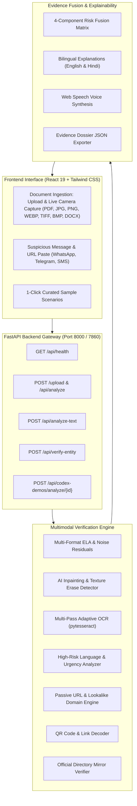

# Proofly

<div align="center">

### **Verify before you trust.**

**Explainable Multimodal Document & Communication Fraud Verification Platform**

[](https://proofly-app.onrender.com)
[](https://github.com/17rajsal/document-forgery-ai/actions/workflows/ci.yml)
[](https://fastapi.tiangolo.com)
[](https://react.dev)
[](https://docker.com)
[](LICENSE)

</div>

> [!TIP]
> 🌐 **Production Web Application (Render)**: [https://proofly-app.onrender.com](https://proofly-app.onrender.com)  
> Configured and deployed via Render Multi-Stage Docker Blueprint (`render.yaml` + `Dockerfile`). Access the live application directly in any desktop or mobile browser without logging in. Both the React 19 SPA frontend and the FastAPI backend are unified in a single high-performance container.

---

## 🎯 Executive Summary & Mission

Digital communication channels have made financial scams and document manipulation increasingly prevalent. Fraudulent schemes often circulate across **messaging applications, email, and social networks**, leveraging manipulated documents and deceptive text to mislead individuals.

These vectors rely on:
1. **Manipulated Documents**: Fabricated certificates, altered receipts, spliced amount fields, and AI-erased text.
2. **High-Risk Claims**: Unrealistic guaranteed return promises, false regulatory endorsements, and artificial FOMO urgency.
3. **Impersonated Entities**: Fake advisories claiming legitimate corporate or regulatory registration numbers.
4. **Deceptive Links & QR Codes**: Lookalike typosquatting domains and redirected personal payment links.

**Proofly** provides a multi-layered verification system that analyzes digital evidence transparently, highlights anomalies, and guides users through independent verification steps before taking action.

---

## 🛡️ Statutory Guardrails & Non-Negotiable Boundaries

> [!IMPORTANT]
> **Strict Operational Boundaries:**
> - ❌ Proofly **NEVER** gives investment advice, stock recommendations, or buy/sell/hold calls.
> - ❌ Proofly **NEVER** promotes financial products, intermediaries, or commercial platforms.
> - ❌ Proofly **NEVER** claims 100% legal certainty or makes conclusive legal fraud determinations.
> - ✅ Proofly **ONLY** flags digital manipulation anomalies, checks directory formats, and provides explainable, probabilistic risk indicators.

All findings strictly distinguish between:
- **`Verified`**: Corroborated against public reference records.
- **`Not Verified`**: Inconsistent formats or conflicting directory records.
- **`Unable to Verify`**: Information could not be independently validated in offline reference mirrors; user is directed to authoritative official portals.

---

## 📊 The 4-Component Risk Framework

Every document, screenshot, pasted message, or URL submitted to Proofly is evaluated across **4 Independent Pillars**:

```
                  ┌────────────────────────────────────────────────────────┐
                  │                    RISK ASSESSMENT                     │
                  │             0 - 100  (HIGH / MODERATE / LOW)           │
                  └───────────────────────────┬────────────────────────────┘
                                              │
         ┌──────────────────┬─────────────────┴────────────────┬──────────────────┐
         ▼                  ▼                                  ▼                  ▼
┌──────────────────┐┌──────────────────┐              ┌──────────────────┐┌──────────────────┐
│DOCUMENT INTEGRITY││HIGH-RISK LANGUAGE│              │ URL/DOMAIN RISK  ││ENTITY VERIF.     │
│  0 - 100 Susp.   ││  0 - 100 Susp.   │              │  0 - 100 Susp.   ││VERIFIED / NOT VER│
│ELA, Inpainting,  ││Guaranteed yields,│              │Lookalike domains,││Official registry │
│Noise, Amount Mod ││Fake auth stamps  │              │HTTP, Raw IPs     ││mirror lookup     │
└──────────────────┘└──────────────────┘              └──────────────────┘└──────────────────┘
```

1. **Document Integrity (`0–100`)**:
   - Multi-format Error Level Analysis (ELA) across JPEG recompression grids.
   - Generative AI inpainting and texture erasure detection via high-frequency noise analysis.
   - Semantic discrepancy checking (e.g. numeric "₹90,000" vs written verbal words "ten thousand rupees").
   - Multi-pass neural OCR (High-contrast, Otsu binarization, Adaptive Gaussian).

2. **High-Risk Language & Urgency (`0–100`)**:
   - Comprehensive pattern triggers for statutorily prohibited financial claims.
   - Flags "guaranteed returns", "double money in 30 days", "zero risk", and artificial countdown deadlines.

3. **URL & Domain Risk (`0–100`)**:
   - Lookalike/typosquatting detection against major financial institutions and portals.
   - Passive inspection: Insecure HTTP, raw IP addresses, URL shorteners, excessive subdomains, and disposable TLDs (`.xyz`, `.top`).

4. **Entity & Registration Verification (`Verified | Not Verified | Unable to verify`)**:
   - Pattern validation for official regulatory intermediary registration formats.
   - Reference directory mirror cross-check detecting entity impersonation.

---

## 🏗️ System Architecture



---

## 🚀 Quick Start & Local Setup

### Prerequisites
- Python 3.10+
- Node.js 18+
- Tesseract OCR (Windows default path: `C:\Program Files\Tesseract-OCR\tesseract.exe` or `apt-get install tesseract-ocr`)

### 1. Clone & Set Up Backend
```bash
git clone https://github.com/17rajsal/document-forgery-ai.git
cd document-forgery-ai

# Activate virtual environment
python -m venv .venv
source .venv/bin/activate  # On Windows: .venv\Scripts\activate

# Install dependencies
pip install -r backend/requirements.txt
```

### 2. Set Up Frontend
```bash
cd frontend
npm install
npm run build
cd ..
```

### 3. Run Application
```bash
# Starts unified FastAPI server serving both API and React frontend SPA
python -m uvicorn backend.main:app --host 0.0.0.0 --port 8000
```
Open **`http://localhost:8000`** in your browser.

---

## 🐳 Docker Deployment

Proofly includes a production-ready, multi-stage `Dockerfile` that packages Node.js, Python 3.12-slim, and Tesseract OCR:

```bash
# Build and run with Docker
docker build -t proofly .
docker run -p 8000:8000 proofly

# Or using Docker Compose
docker-compose up --build
```

---

## 🧪 Comprehensive Test Suite (100% Pass Rate)

Proofly includes rigorous test suites validating security, ML inference, entity verification, and API stability:

```bash
# 1. Run Core Multimodal Forensic Tests (10/10 Passed)
python -m unittest tests/test_proofly.py

# 2. Run Safety & Fraud Engine Tests (13/13 Passed)
python -m unittest tests/test_investor_safety.py

# 3. Run Intelligence API Regression Tests (18/18 Passed)
python backend/test_intelligence.py

# 4. Run Full End-to-End Enterprise Integration Suite (25/25 Passed)
python backend/test_integration.py
```

### Test Coverage Highlights
- ✅ **Format Ingestion**: PDF, DOCX, TIFF, BMP, WEBP, PNG, JPG verified.
- ✅ **Security Hardening**: Disguised magic bytes, disallowed file extensions, 0-byte uploads, and path traversals blocked.
- ✅ **Entity Verification**: Official regulatory formats verified; impersonation and malformed registrations flagged.
- ✅ **Lookalike Domains**: Typosquatting of institutions reliably intercepted.
- ✅ **Privacy Mode**: Ephemeral in-memory handling with zero retention of uploaded documents.

---

## 🏛️ Hackathon Context & Heritage

Proofly was originally prototyped for the **SANGYAN Investor Resilience Hackathon** organized by **IIT (BHU)** in collaboration with **SEBI and NSDL** (Track A: Digital Fraud Resilience & Track E: Misinformation & Content Literacy). The codebase has since been evolved into an independent, production-grade fraud and document verification service.

---

## 🔗 Official Repository & Links

- **GitHub Repository**: [https://github.com/17rajsal/document-forgery-ai](https://github.com/17rajsal/document-forgery-ai)
- **Live Production Application**: [https://proofly-app.onrender.com](https://proofly-app.onrender.com)
- **Security Policy**: [SECURITY.md](SECURITY.md)

---

<div align="center">
  <sub>Proofly provides risk indicators and educational safety guidance. It does not guarantee authenticity or replace official verification.</sub>
</div>
