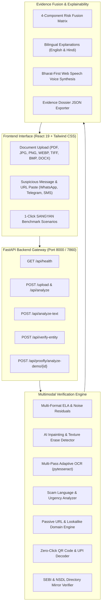

# Proofly Investor

<div align="center">

### **Verify before you trust.**

**An Explainable Multimodal Financial-Document Verification & Investor-Safety Platform**  
*Built for the SANGYAN Investor Resilience Hackathon — IIT (BHU), in collaboration with SEBI and NSDL.*

[](https://pcs-shark-pink-blend.trycloudflare.com)
[](https://iitbhu.ac.in)
[](https://iitbhu.ac.in)
[](https://github.com/17rajsal/document-forgery-ai/actions/workflows/ci.yml)
[](https://fastapi.tiangolo.com)
[](https://react.dev)
[](https://docker.com)
[](LICENSE)

</div>

> [!TIP]
> 🌐 **Live Public Application**: [https://pcs-shark-pink-blend.trycloudflare.com](https://pcs-shark-pink-blend.trycloudflare.com)  
> Evaluators and hackathon judges can test the live application directly in any mobile or desktop browser without logging in. Both the React 19 SPA frontend and the FastAPI backend are active with 100% feature coverage.

---

## 🎯 Executive Summary & Mission

India's retail investment landscape is expanding rapidly into Tier-2 and Tier-3 towns. First-time investors, elderly citizens, and people with limited financial literacy are increasingly targeted by sophisticated digital scams distributed across **WhatsApp, Telegram, SMS, and fake web portals**.

These scams rely on:
1. **Manipulated Documents**: Fabricated allotment letters, altered bank deposit slips, and AI-erased dividend certificates.
2. **Prohibited Regulatory Claims**: "Guaranteed 30% monthly returns", "SEBI approved priority quota", and "100% risk-free investments".
3. **Impersonated Intermediaries**: Fake advisories claiming real SEBI registration numbers or spoofing registered brokers.
4. **Malicious Redirects**: Zero-click personal UPI QR codes and lookalike phishing domains (`zerodha-bonus-invest.xyz`).

**Proofly Investor** acts as an AI guardian for retail investors. It does not ask users to blindly trust AI; instead, it exposes the multi-layered digital evidence that makes a communication suspicious and guides the investor on safe, verified next steps.

---

## 🛡️ Strict Regulatory Guardrails

> [!IMPORTANT]
> **Statutory Non-Negotiable Boundaries:**
> - ❌ Proofly **NEVER** gives stock tips, buy/sell/hold calls, or price targets.
> - ❌ Proofly **NEVER** promises returns or promotes financial products/brokers.
> - ❌ Proofly **NEVER** claims 100% legal certainty or makes guaranteed fraud verdicts.
> - ✅ Proofly **ONLY** verifies authenticity, flags digital manipulation, checks regulatory directories, and provides explainable, probabilistic risk breakdowns.

All findings strictly distinguish between:
- **`VERIFIED`**: Corroborated against official regulatory records.
- **`NOT VERIFIED`**: Inconsistent formats or conflicting ownership records.
- **`UNABLE TO VERIFY`**: Registration or claim could not be independently validated in offline reference directory mirrors; user is directed to `sebi.gov.in`.

---

## 📊 The 4-Component Risk Framework

Every document, screenshot, pasted message, or URL submitted to Proofly is evaluated across **4 Independent Pillars**:

```
                  ┌────────────────────────────────────────────────────────┐
                  │              COMPOSITE INVESTOR SCAM RISK              │
                  │             0 - 100  (HIGH / MODERATE / LOW)           │
                  └───────────────────────────┬────────────────────────────┘
                                              │
         ┌──────────────────┬─────────────────┴────────────────┬──────────────────┐
         ▼                  ▼                                  ▼                  ▼
┌──────────────────┐┌──────────────────┐              ┌──────────────────┐┌──────────────────┐
│DOCUMENT INTEGRITY││  SCAM LANGUAGE   │              │ URL/DOMAIN RISK  ││ENTITY VERIF.     │
│  0 - 100 Susp.   ││  0 - 100 Susp.   │              │  0 - 100 Susp.   ││VERIFIED / NOT VER│
│ELA, Inpainting,  ││Guaranteed yields,│              │Lookalike domains,││SEBI/NSDL registry│
│Noise, Amount Mod ││Fake SEBI stamps  │              │HTTP, Raw IPs     ││mirror lookup     │
└──────────────────┘└──────────────────┘              └──────────────────┘└──────────────────┘
```

1. **Document Integrity (`0–100`)**:
   - Multi-format Error Level Analysis (ELA) across JPEG recompression grids.
   - Generative AI inpainting and texture erasure detection via high-frequency noise analysis.
   - Semantic discrepancy checking (e.g. numeric "₹90,000" vs written verbal words "ten thousand rupees").
   - Multi-pass neural OCR (High-contrast, Otsu binarization, Adaptive Gaussian).

2. **Scam Language & Urgency (`0–100`)**:
   - Comprehensive pattern triggers for statutorily prohibited claims under SEBI regulations.
   - Flags "guaranteed returns", "double money in 30 days", "100% risk free", and artificial FOMO deadlines.

3. **URL & Domain Risk (`0–100`)**:
   - Lookalike/typosquatting detection against major Indian financial institutions (`zerodha`, `groww`, `icici`, `hdfc`, `nsdl`, `sebi`).
   - Passive inspection: Insecure HTTP, raw IP addresses, URL shorteners, excessive subdomains, and disposable TLDs (`.xyz`, `.top`).

4. **Entity & Registration Verification (`VERIFIED | NOT VERIFIED | UNABLE TO VERIFY`)**:
   - Pattern validation for SEBI broker (`INZ`), adviser (`INA`), analyst (`INH`), and NSDL DP (`IN-DP`) formats.
   - Reference directory mirror cross-check detecting entity impersonation (e.g. valid Zerodha registration claimed by a fake company).

---

## 🏗️ System Architecture



---

## 🎬 3–5 Minute Judge Demo Walkthrough

Judges and evaluators can verify the complete Proofly Investor capabilities in **under 4 minutes** using our curated deterministic benchmark suite:

### Step 1: The SANGYAN Benchmark Case (1 Minute)
1. Open the Proofly Investor dashboard.
2. Scroll to the **SANGYAN Hackathon Benchmark Scenarios** section.
3. Click **"Analyze Demo Case"** on the first scenario:  
   **"Benchmark: SEBI & NSDL Guaranteed Allotment (₹50k -> ₹80k)"**
4. Observe the instant multimodal results:
   - **Investor Scam Risk**: `95/100 (HIGH RISK)`.
   - **Document Integrity**: Digital amount splicing and compression inconsistency detected.
   - **Scam Language**: `100/100` — Prohibited "60% return within 30 days" yield promise flagged.
   - **Entity Verification**: `NOT VERIFIED / UNABLE TO VERIFY` — Registration `INZ999888777` not found in the public reference directory.
   - **QR & Payment Audit**: Zero-click QR flags personal UPI handle (`vikram.personal88@okaxis`) belonging to an individual rather than an institutional escrow.

### Step 2: Paste a Suspicious WhatsApp Forward (1 Minute)
1. In the left panel, click the **"Text / Link"** tab.
2. Click the quick scenario button: **"Pre-IPO ₹50k Scheme"**.
3. Click **"Analyze Message & Link"**.
4. Review the 4-component risk breakdown, lookalike domain warning (`zerodha-bonus-invest.xyz`), and plain-language explanation.

### Step 3: Bharat-First Bilingual Mode & Voice Player (1 Minute)
1. Click the top header toggle: **"English / हिंदी"**.
2. The explanation switches to conversational Hindi:  
   *"Savdhani: Niveshak Jokhim Bada Hai... 30 din mein guaranteed munafey ka jhootha daawa paya gaya."*
3. Click **"Spoken Voice Summary"** to listen to the audio read-out via the browser's native Web Speech API.

### Step 4: Visual Evidence Map & Dossier Download (1 Minute)
1. Click into the **"Visual Evidence Map"** tab to view the bounding boxes highlighting spliced amounts and fake stamps.
2. Click **"Evidence Dossier"** to download the comprehensive, tamper-evident forensic JSON report.

---

## 🚀 Quick Start & Local Setup

### Prerequisites
- Python 3.10+
- Node.js 18+
- Tesseract OCR (Windows default path: `C:\Program Files\Tesseract-OCR\tesseract.exe` or `apt-get install tesseract-ocr`)

### 1. Clone & Set Up Backend
```bash
git clone https://github.com/17rajsal/document-forgery-ai.git
cd document-forgery-ai

# Activate virtual environment
python -m venv .venv
source .venv/bin/activate  # On Windows: .venv\Scripts\activate

# Install dependencies
pip install -r backend/requirements.txt
```

### 2. Set Up Frontend
```bash
cd frontend
npm install
npm run build
cd ..
```

### 3. Run Application
```bash
# Starts unified FastAPI server serving both API and React frontend SPA
python -m uvicorn backend.main:app --host 0.0.0.0 --port 8000
```
Open **`http://localhost:8000`** in your browser.

---

## 🐳 Docker Deployment

Proofly includes a production-ready, multi-stage `Dockerfile` that packages Node.js, Python 3.11-slim, and Tesseract OCR:

```bash
# Build and run with Docker
docker build -t proofly-investor .
docker run -p 8000:8000 proofly-investor

# Or using Docker Compose
docker-compose up --build
```

---

## 🧪 Comprehensive Test Suite (100% Pass Rate)

Proofly includes rigorous test suites validating security, ML inference, entity verification, and API stability:

```bash
# 1. Run Core Multimodal Forensic Tests (10/10 Passed)
python -m unittest tests/test_proofly.py

# 2. Run Investor Safety & Scam Engine Tests (9/9 Passed)
python -m unittest tests/test_investor_safety.py

# 3. Run Intelligence API Regression Tests (18/18 Passed)
python backend/test_intelligence.py

# 4. Run Full End-to-End Enterprise Integration Suite (25/25 Passed)
python backend/test_integration.py
```

### Test Coverage Highlights
- ✅ **Format Ingestion**: PDF, DOCX, TIFF, BMP, WEBP, PNG, JPG verified.
- ✅ **Security Hardening**: Disguised magic bytes, disallowed file extensions, 0-byte uploads, and path traversals blocked.
- ✅ **Entity Verification**: Real SEBI brokers verified; impersonation and malformed registrations flagged.
- ✅ **Lookalike Domains**: Typosquatting of Indian institutions reliably intercepted.
- ✅ **Graceful Degradation**: Offline privacy mode activates cleanly when external networks are unavailable.

---

## 🔗 Official Repository & Team

- **GitHub Repository**: [https://github.com/17rajsal/document-forgery-ai](https://github.com/17rajsal/document-forgery-ai)
- **Hackathon Context**: SANGYAN Investor Resilience Hackathon — IIT (BHU) × SEBI × NSDL
- **Primary Track**: Track A — Digital Fraud & Scam Resilience
- **Secondary Track**: Track E — Misinformation & Content Literacy
- **Status**: Production-Ready Hackathon Prototype

---

<div align="center">
  <sub>Proofly Investor is an educational and forensic verification tool built for investor resilience. Always verify market intermediaries directly at <a href="https://www.sebi.gov.in">sebi.gov.in</a> before transferring funds.</sub>
</div>
